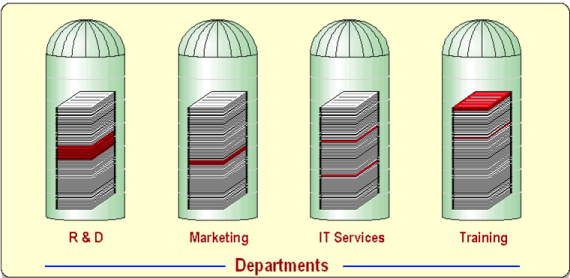

# Actividad 1-CC3S2

## Información

- Nombre: Diego Akira García Rojas
- Fecha de presentación: 03-09-25
- Tiempo invertido: 00:15
- Entorno:
  - Editor de texto: Doom Emacs
  - Cliente Git: Magit
  - Desarrollo de diagramas: draw.io
  - Sistema operativo: Fedora Linux 42

## Desarrollo

### DevOps vs. Cascada tradicional

- ¿Por qué DevOps acelera y reduce riesgo en software para la nube frente a cascada?
  - La nube se beneficia enormemente de la automatización al poder adaptarse a la infraestructura necesaria con cada iteración con pequeños cambios, lo cual tomaría demasiado tiempo en una metodología de cascada. Además, el riesgo en software se reduce al poder tener feedback constante tanto de uso por parte de los usuarios como por resultados de pruebas integradas con cada despliegue.

- ¿En qué contexto real se puede usar un enfoque cercano a cascada?
  - Los proyectos en los que es poco probable que se tengan cambios constantes o en los que se tenga alta regulación y control, como software cercano al hardware en dispositivos embebidos o dispositivos médicos. Estos últimos particularmente requieren un cumplimiento de requisitos y estándares rigurosos para los que DevOps no encajaría adecuadamente.
  - Criterios verificables
    - Cumplimiento normativo: En software utilizado en el área de salud, se realiza un seguimiento constante del desarrollo para que cumpla con estándares.
    - Control de calidad: Se espera que se cumpla con un estándar de calidad para lo que el enfoque de cascada sería más útil frente al cambiante de Devops.
  - Trade-offs
    - El enfoque de cascada ofrece más seguridad al tener pasos más rigurosos y definidos al sacrificar velocidad y cambios rápidos.
    - El enfoque de cascada asegura un estándar de calidad final luego de pasar por todos las etapas necesarias a cambio de un software difícil de actualizar una vez terminado.

### Ciclo tradicional de dos pasos y silos

- Identifica dos limitaciones del ciclo de construcción y operación sin integración continua.
  - **Grandes lotes de trabajo**: La separación en fases de construcción y operación hace que el código se integre con poca frecuencia y, en caso se encuentren errores, estos se tengan que solucionar regresando a la fase de construcción. Esto aumenta el tiempo de desarrollo en total.
  - **Colas de defectos**: Al tener un bajo ritmo de integración, los defectos no se detectan hasta el paso de operación, para los cuales se pueden haber acumulado varios.

- Define dos anti-patrones y explica cómo agravan incidentes.
  - **Spaghetti code**: Cuando el código se vuelve difícil de leer, poco modular, poco estructurado y de alta complejidad. Esto resulta en código difícil de mantener y en errores más difíciles de corregir a la larga.
  - **Throw over the wall**: Dejar el trabajo a otro equipo o a etapas tardías esperando que alguien más lo haga. Esto reduce la colaboración entre equipos y en caso de un incidente puede aumentar el MTTR, ya que un equipo que no desarrolló el código puede encontrarse con partes difíciles de comprender.
