# Actividad 4

## Sección 1: Manejo sólido de CLI

### Navegación básica

#### Ejercicios de reforzamiento

1. Archivos en `/etc`

    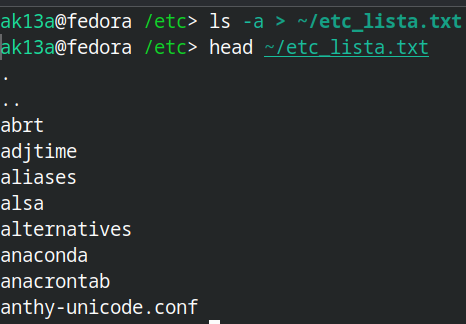

2. Listar los archivos en `/tmp` con globbing

   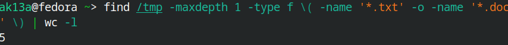 
   
3. Crear un archivo con `printf`

    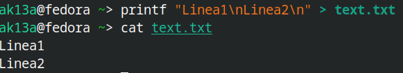

### Administración básica

#### Ejercicios de reforzamiento

1. Usuarios/grupos/permisos

   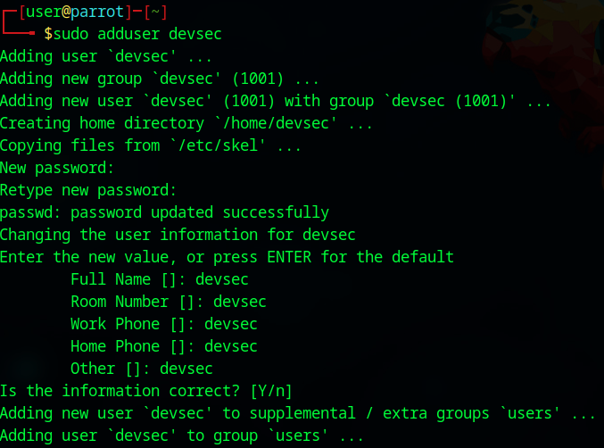 

    

   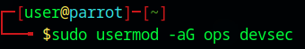 

   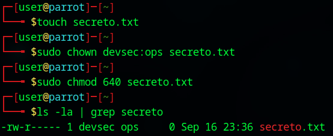 

2. Procesos/Señales

    

3. systemd

   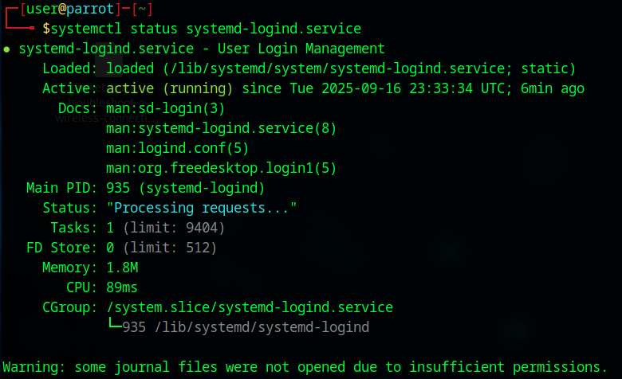 

   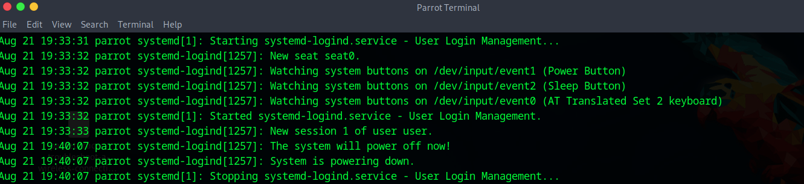 
   
### Utilidades de texto de Unix

1. Grep para buscar root

   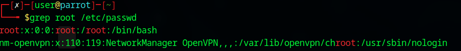 
   
2. awk y cut

   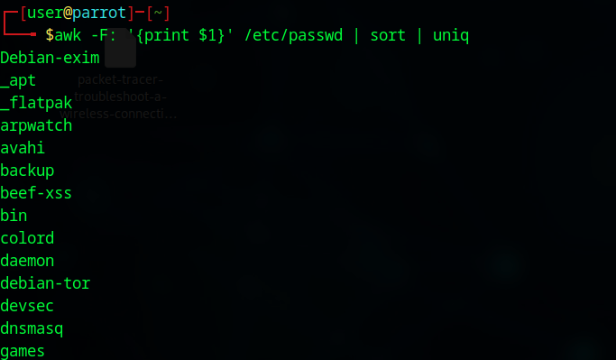 
   
3. tr

   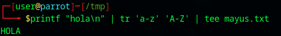 
   
4. find

   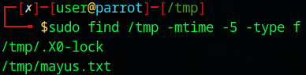 
