# Reporte de Actividad 5

## Parte 1

1. 
   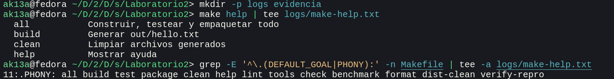

   - `help` muestra todos los targets que se pueden ejecutar con el archivo Makefile junto al comentario de ayuda que tienen. 
   - Al definir `.DEFAULT_GOAL`, se define un objetivo por defecto que se ejecuta cuando se ejecuta `make` sin objetivos. En otras palabras, es el objetivo por defecto y toma precedencia ante el primer objetivo definido, el cual es el ejecutado por defecto cuando no se tiene definido `.DEFAULT_GOAL`.
   - `.PHONY` sirve para declarar objetivos sin tener que preocuparse de tener accidentalmente archivos con el mismo nombre. De esta forma, se evitan posibles problemas de ejecución al querer ejecutar un objetivo pero accidentalmente se ejecute un archivo.

2. 

   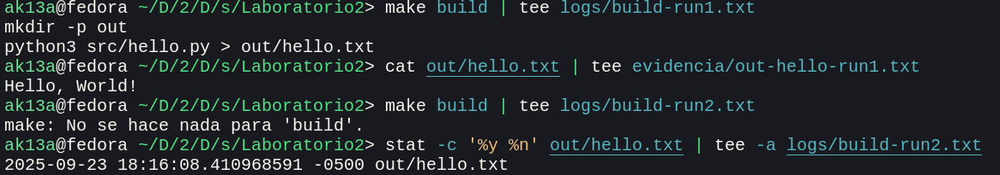
   

   - La primera ejecución se realiza en su completitud por no tener sus dependencias completas: la dependencia de `hello.txt` no existe, por lo que se crea con la tarea que depende de `hello.py`.
    
3. 

   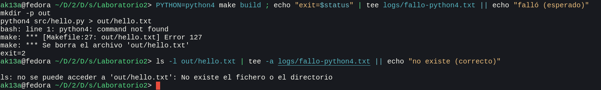
   
   - En out no hay salida parcial.
   - `-euo pipefail` evita que el script siga ejecutándose cuando ocurra algún error de comandos o variables, por lo que se evita que el script siga creando archivos con errores en caso se encuentren.
   - `.DELETE_ON_ERROR` asegura que, en caso alguna tarea de Make falle, los archivos generados en las tareas son eliminados.

4. 

   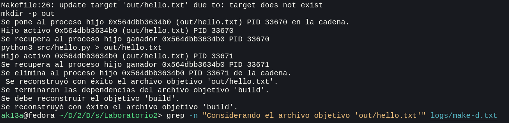


   - Las líneas más importantes son:
   ```
Se considera el archivo objetivo 'build'.
 El archivo 'build' no existe.
 Se considera el archivo objetivo 'out/hello.txt'.
  El archivo 'out/hello.txt' no existe.
  Se considera el archivo objetivo 'src/hello.py'.
   Buscando una regla implícita para 'src/hello.py'.
   No se ha encontrado ninguna regla implícita para 'src/hello.py'.
  Se terminaron las dependencias del archivo objetivo 'src/hello.py'.
  No es necesario reconstruir el objetivo 'src/hello.py'..
 Se terminaron las dependencias del archivo objetivo 'out/hello.txt'.
 Se debe reconstruir el objetivo 'out/hello.txt'.
   ```
   - Estas demuestran el razonamiento de Make para reconstruir archivos:
     - Verifica si existe un archivo con el nombre de la tarea.
     - Se verifican las dependencias del archivo objetivo.
     - Si la dependencia existe, no se hace nada.
     - Si es que no existe, se debe generar.
   - Así concluye qué archivos regenerar o no.


5. 

   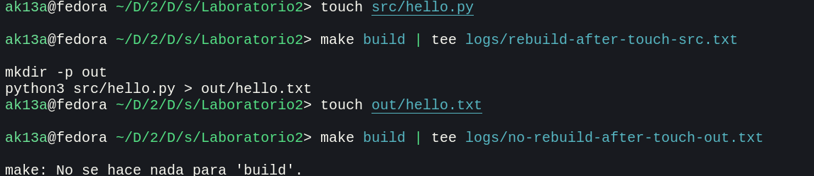
   
   - Tocar la fuente require trabajo extra porque es una dependencia de `hello.txt`. Si la fuente ha cambiado, entonces los demás componentes que dependen de este probablemente también hayan cambiado, por lo que requieren reconstruirse. En cambio, si se toca el objetivo, no hay ningún componente que dependa de este, por lo que puede omitirse su reconstrucción.
   
6. 

   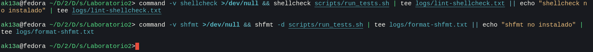
   
   - Las herramientas fueron ejecutadas exitosamente. Esto se comprueba por la falta de salida, indicando que no hubo errores.

7. 

   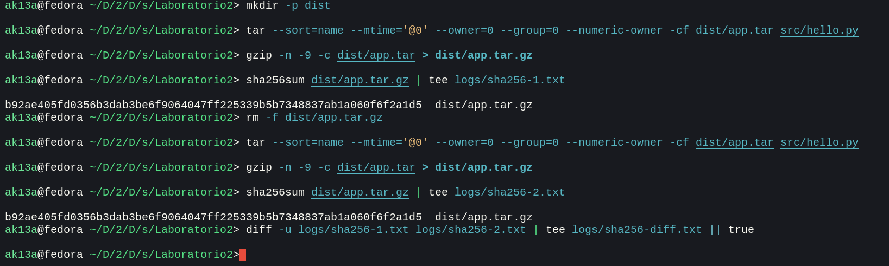
   
   - Las banderas pasadas en `tar` y `gzip` eliminan la variabilidad de las builds.
     - `--sort=name` hace que el orden de los nombres sea lexicográfico y que no dependa del sistema.
     - `--mtime='@0'` hace que la fecha de modificación de los archivos sea la fecha 0 de Unix.
     - `--numeric-owner` y las banderas de usuarios, grupos y dueños hacen que no se filtren datos de creación y que los metadatos de dueño sean simplemente `0:0`.
     - `gzip -n` hace que no se guarde el tiempo en el comprimido.
     
8. 

   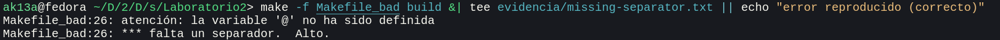
   
   - El motivo del fallo es histórico. Make en sus inicios necesitaba una forma sencilla de distinguir comandos shell de otras líneas, por lo que una de las formas más sencillas era distinguirlas con tabulaciones.

## Parte 2

### Crear un script bash

#### Ejercicios

1. **Ejecutar ./scripts/run\_tests.sh**

    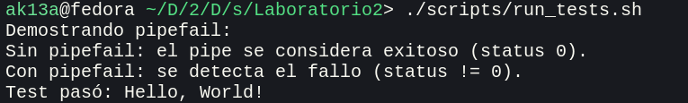
    
2. **Editar src/hello.py**

    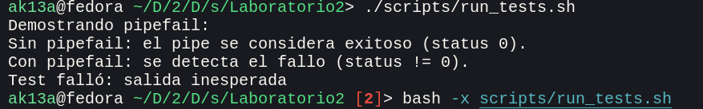
    
    Se verifica el código de error 2 en el terminal.
    
3. **Ejecutar `bash -x scripts/run_tests.sh`**

    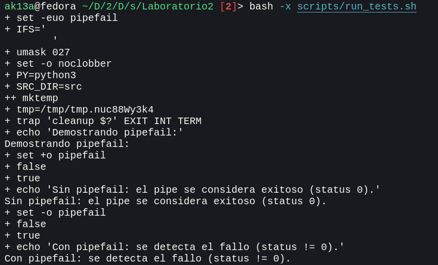

4. **Sustituye `output=$("$PY" "$script")` por `("$PY" "$script")`.**

    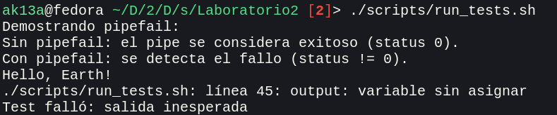
