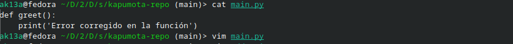

# Actividad 6

## Parte 1

### `git config`

- La salida de `git config --list` se encuentra en `logs/config.txt`

### `git init` y `status`

- La salida de `git init` y `git status` se encuentra en `logs/init-status.txt`

### `git version` 

- La salida de `git version` se encuentra en `logs/git-version.txt`

### `git add` y `git commit`

- La salida de `git add` y `git commit` se encuentra en `logs/add-commit.txt`

### `git branch`

- La salida de `git branch -vv` se encuentra en `branches.txt`.

### `git merge`

- La salida de `git merge` se encuentra en `merge-o-conflicto.txt`.

### Preguntas de `git log`

#### `git log` con formato

```
git log --graph --pretty=format:'%x09 %h %ar ("%an") %s'
*        fd2e0dd hace 7 minutos ("Akira-13") Commit inicial con README.md
```

#### `git log --oneline` 

``` 
git log --oneline
e4e6993 (HEAD -> main) Congirua la documentación base del repositorio
fd2e0dd Commit inicial con README.md
```


### Preguntas de `git`

#### ¿Cómo te ha ayudado Git a mantener un historial claro y organizado de tus cambios?

- Git me permite tener un historial claro del trabajo realizado en una base de código. En caso de tener desvíos, puedo ver en qué puntos y en qué difieren las ramas generadas.

#### ¿Qué beneficios ves en el uso de ramas para desarrollar nuevas características o corregir errores?

- Las ramas son útiles para desarrollar nuevas características ya que me permiten tener mayor libertad de experimentación y desarrollo sin afectar el código principal. Esto también ocurre al corregir errores, ya que necesitaré asegurarme que el parche que desarrolle efectivamente corrija errores antes de implementarlos en la rama principal.

### Ejercicios

#### Ejercicio 1

1. **Manejo avanzado de ramas y resolución de conflictos**

    

2. **Modificar archivos en la nueva rama**

    

3. **Simular un desarrollo paralelo en la rama main**

    

4. **Intentar fusionar la rama feature/advanced-feature en main**

    

5. **Resolver el conflicto de fusión**

    

6. **Eliminar la rama fusionada**

    

#### Ejercicio 2

1. **Ver el historial detallado de commits**

    
    
    En verde están las líneas agregadas en cada archivo, mientras que las líneas rojas son las líneas eliminadas. Esto no se ve en la fusión.

2. **Filtrar commits por autor**

    

3. **Revertir un commit**

    
    
    Se debe usar la bandera `-m` para indicar que quiero revertir a la rama principal o main, ya que este commit es de fusión.


#### Ejercicio 3

1. **Crear una nueva rama desde un commit específico**

    

2. **Modificar y confirmar cambios en la nueva rama**

    

3. **Fusionar los cambios en la rama principal**

    


3. **Eliminar la rama bugfix/rollback-feature**

    

#### Ejercicio 4

1. **Hacer cambios en el archivo main.py**

    

2. **User git reset para deshacer el commit**

    

3. **Usar git restore para deshacer cambios no confirmados**

    
