# Actividad 9

## Ejecución inicial en Makefile

Se tuvo que modificar ligeramente el `Makefile` propuesto para ejecutar `pytest` desde la raíz y no tener que generar un `.venv` en cada directorio.

```Make
test_all: deps
	$(PYTEST) -q soluciones/aserciones_pruebas|| exit 1
	$(PYTEST) -q soluciones/pruebas_pytest|| exit 1
	$(PYTEST) -q soluciones/pruebas_fixtures|| exit 1
	$(PYTEST) --cov=models --cov-report term-missing -q soluciones/coverage_pruebas|| exit 1
	$(PYTEST) -q soluciones/factories_fakes|| exit 1
	$(PYTEST) -q soluciones/mocking_objetos|| exit 1
	$(PYTEST) -q soluciones/practica_tdd|| exit 1
```

### Evidencia de ejecución de `make_all`

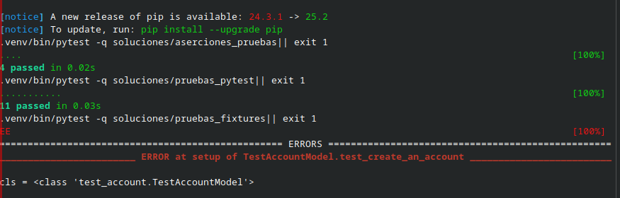

## `aserciones_pruebas`

### Ejecución de pruebas

Después de modificar las pruebas según las indicaciones, se tiene:

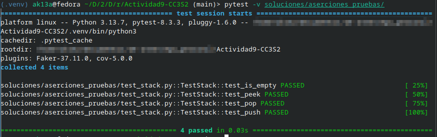

### Ejecución de cobertura

Al ejecutar las pruebas de cobertura, se tiene el siguiente resultado:


El cual demuestra una cobertura completa del código desarrollado en las pruebas.

## `coverage_pruebas`

La propuesta de ejecución de pruebas de coberturas con reporte en Makefile no funcionaba, por lo que se tuvo que modificar:

```
pytest --cov=models --cov-report html:htmlcov_pruebas -q
```

Con esto, se generaron los reportes necesarios.

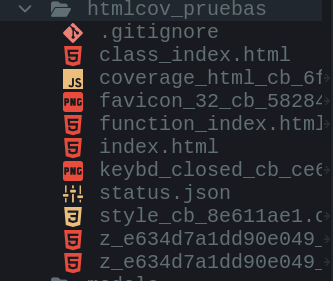

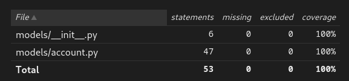

## `factories_fakes`

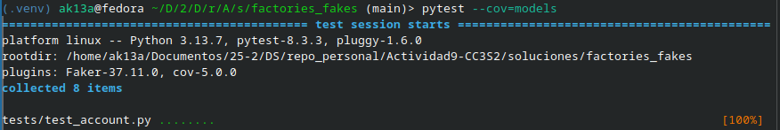

Las pruebas se ejecutan en su completitud con algunas advertencias. Esto demuestra que los fakes y fixtures utilizados se usan adecuadamente, evitando el uso de datos estáticos.

## `mocking_objetos`

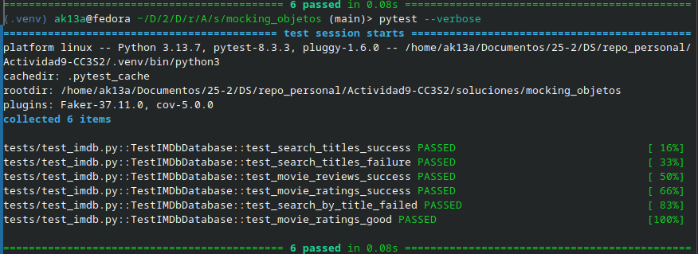

En este ejercicio, las indicaciones dadas por las instrucciones llevaron a pruebas fallidas, por lo que se ejecuta en su forma original. Con Mocking podemos simular comportamiento que no nos importa testear para analizar el comportamiento de otras funcionalidades que dependen de las primeras.

## `practica_tdd`

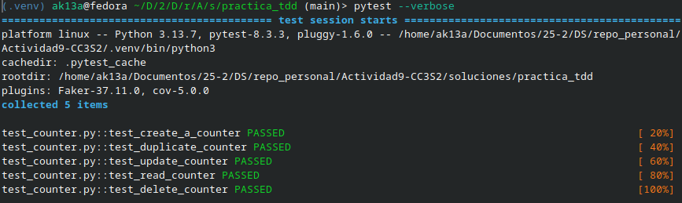

En este ejercicio, se realiza un desarrollo Red-Green-Refactor, el cual sigue un proceso de desarrollo basado en pruebas. De esta forma, se definen comportamientos esperados de código antes de desarrollarlo. Así, se definen objetivos de desarrollo inmediatos y se tienen claros los contratos de salida.

## `pruebas_fixtures`

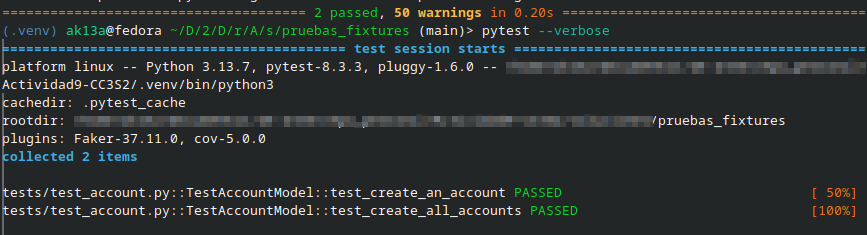

En este ejercicio, se realizan pruebas utilizando fixtures para establecer un entorno de pruebas sencillo y desmantelarlo tras las pruebas.

## `pruebas_fixtures`


En este ejercicio, se realizan pruebas utilizando fixtures para establecer un entorno de pruebas sencillo y desmantelarlo tras las pruebas.

## `pruebas_pytest`

### Ejecución inicial

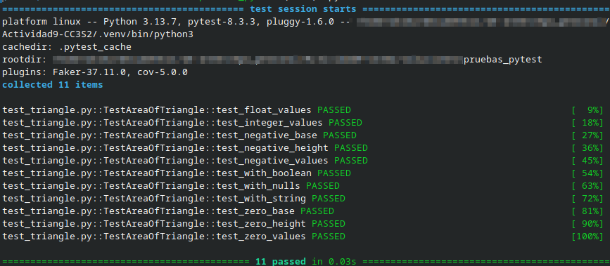

En la ejecución inicial, se ejecutan todas las pruebas y se muestra la salida con verbosidad.

### Cobertura

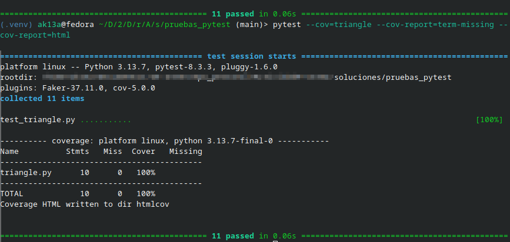

La ejecución con pruebas de cobertura muestra el código ejecutado al ejecutar las pruebas. Además, se genera un reporte en HTML.

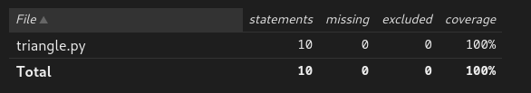

### `setup.cfg`

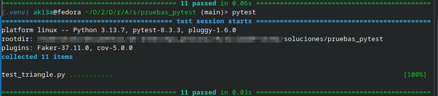

Utilizando el archivo `setup.cfg` se automatiza la ejecución de pytest para utilizar las banderas y opciones que este archivo especifica, ahorrándonos el trabajo de especificar las opciones manualmente.
